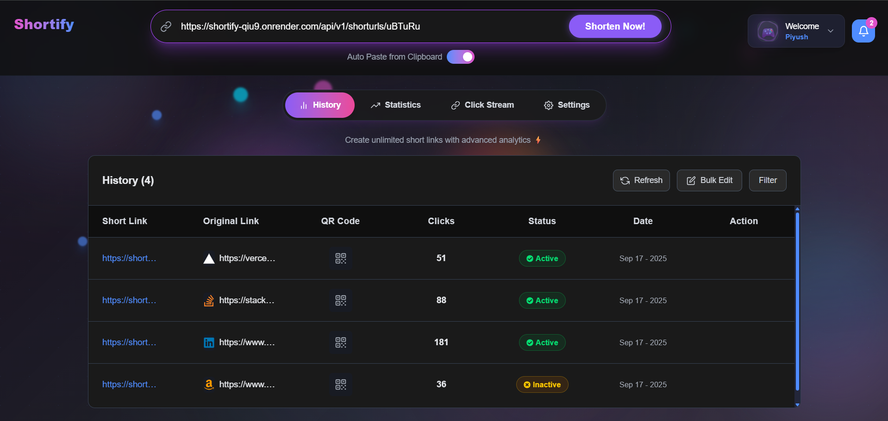
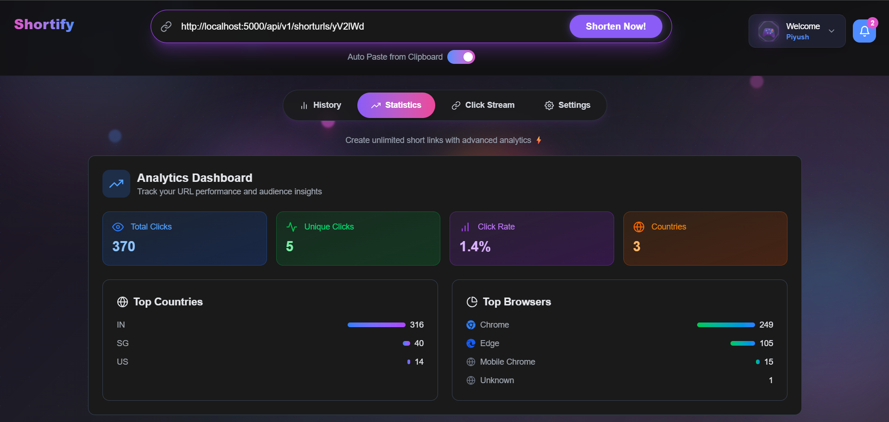
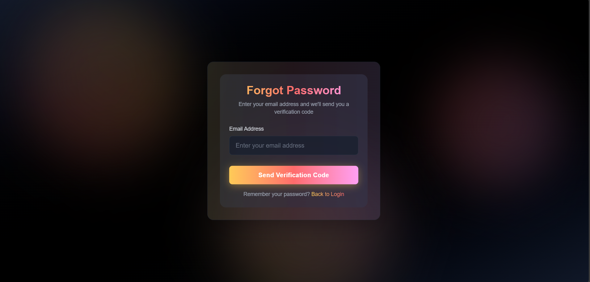
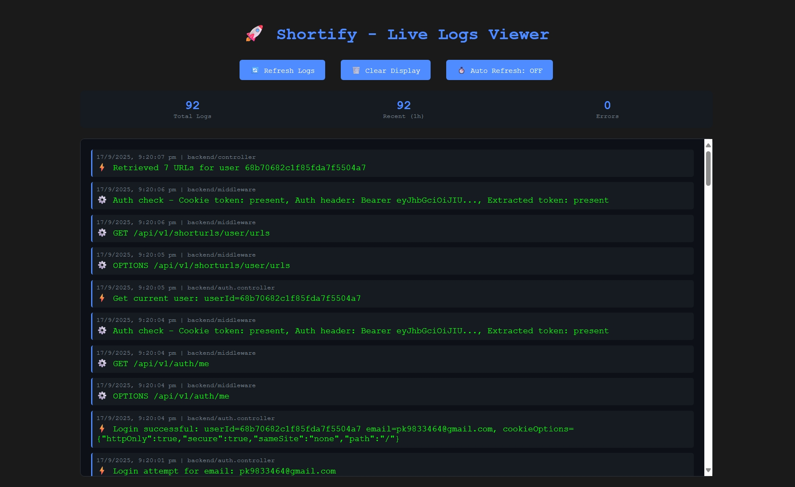

# 🚀 Shortify - URL Shortening Platform

[](https://nextjs.org/)
[](https://www.typescriptlang.org/)
[](https://nodejs.org/)
[](https://www.mongodb.com/)
[](https://tailwindcss.com/)

A modern URL shortening platform built with Next.js 15 and Node.js. Features include URL analytics, QR code generation, and a beautiful glass morphism UI with multiple theme support.

## 🌟 Features

### 🎯 **Core Functionality**

- **URL Shortening** - Convert long URLs into short, shareable links
- **QR Code Generation** - Generate QR codes with download functionality
- **Link Analytics** - Click tracking with geographic data
- **Bulk Operations** - Manage multiple URLs at once
- **Website Icons** - Auto-detection of platform icons (GitHub, YouTube, etc.)

### 🎨 **User Interface**

- **Glass Morphism Design** - Modern UI with blur effects and gradients
- **Multiple Themes** - Glass (default), Light, and Dark theme variants
- **Responsive Design** - Works on desktop and mobile devices
- **Smooth Animations** - Framer Motion transitions
- **Auto Paste** - Smart clipboard detection for quick URL input

### 🔐 **Authentication**

- **User Registration** - Account creation with email verification
- **JWT Authentication** - Secure user sessions
- **Password Reset** - Forgot password with OTP verification using Resend
- **Protected Routes** - User-specific URL management

## � Live Demo

- **Frontend**: [https://shortify-7l1m.vercel.app](https://shortify-7l1m.vercel.app)
- **API Backend**: [https://shortify-qiu9.onrender.com](https://shortify-qiu9.onrender.com)

### 🎯 Try These Features:

- ✅ **URL Shortening** - Paste any long URL and get instant short link
- ✅ **Real-time Analytics** - Watch click statistics update live
- ✅ **QR Code Generation** - Generate and download QR codes
- ✅ **Theme Switching** - Try Glass, Light, and Dark themes

## 💻 Tech Stack

### Frontend

- **Framework**: Next.js 15 with App Router (Turbopack)
- **Language**: TypeScript 5
- **Styling**: Tailwind CSS 4 + Custom CSS
- **Animations**: Framer Motion 12
- **State Management**: React Hooks + Context
- **Icons**: React Icons (Heroicons, React Icons)
- **QR Code**: qrcode library
- **Theme Support**: next-themes (Glass/Light/Dark)
- **Particles**: tsparticles (background effects)

### Backend

- **Runtime**: Node.js 18+
- **Framework**: Express.js
- **Database**: MongoDB with Mongoose ODM
- **Authentication**: JWT + bcryptjs
- **Email Service**: Resend (for password reset emails)
- **Geographic Data**: geoip-lite (for click location tracking)
- **Logging**: Custom HTTP-based logging middleware

### Deployment

- **Frontend Hosting**: Vercel
- **Backend Hosting**: Render
- **Database**: MongoDB Atlas
- **Version Control**: Git & GitHub

## 📦 Installation & Setup

### Prerequisites

- Node.js 18.0 or higher
- MongoDB Atlas account or local MongoDB
- Git

### 1. Clone Repository

```bash
git clone https://github.com/piyush-bagoria018/Shortify.git
cd Shortify
```

### 2. Backend Setup

```bash
cd backend
npm install
cp .env.example .env
# Configure environment variables in .env
npm run dev
```

### 3. Frontend Setup

```bash
cd frontend
npm install
# Update API endpoints in src/config/api.ts
npm run dev
```

### 4. Environment Variables

#### Backend (.env)

```env
PORT=3001
MONGODB_URI=mongodb://localhost:27017/shortify
JWT_SECRET=your-super-secret-jwt-key
JWT_EXPIRES_IN=7d

# Resend Email Service Configuration
RESEND_API_KEY=your-resend-api-key
FROM_EMAIL=noreply@shortify.com
FROM_NAME=Shortify

# Application URLs
FRONTEND_URL=http://localhost:3000
NODE_ENV=development

# Logging Service (Optional)
LOGGING_SERVICE_URL=https://logging-middleware-iub8.onrender.com
```

#### Frontend (next.config.ts)

```typescript
NEXT_PUBLIC_API_URL=http://localhost:3000/api
NEXT_PUBLIC_BASE_URL=http://localhost:3000
```

## 🔧 Development

### Available Scripts

#### Frontend

```bash
npm run dev          # Start development server with Turbopack
npm run build        # Build for production
npm run start        # Start production server
npm run lint         # Run ESLint
```

#### Backend

```bash
npm run dev          # Start with nodemon
npm run start        # Start production server
```

### Project Structure

```
afford-medical/
├── backend/                 # Node.js API server
│   ├── src/
│   │   ├── controllers/     # Route controllers
│   │   │   ├── auth.controller.js
│   │   │   └── url.controller.js
│   │   ├── middleware/      # Custom middleware
│   │   │   └── auth.middleware.js
│   │   ├── models/         # Database models
│   │   │   ├── user.model.js
│   │   │   └── url.model.js
│   │   ├── routes/         # API routes
│   │   │   ├── auth.routes.js
│   │   │   └── url.routes.js
│   │   ├── services/       # Business logic
│   │   │   ├── email.service.js
│   │   │   └── otp.service.js
│   │   ├── db/            # Database connection
│   │   │   └── DB.js
│   │   ├── app.js         # Express app setup
│   │   ├── index.js       # Server entry point
│   │   └── constant.js    # App constants
│   └── package.json
│
├── frontend/               # Next.js React app
│   ├── src/
│   │   ├── app/           # App Router pages
│   │   │   ├── dashboard/
│   │   │   ├── login/
│   │   │   ├── register/
│   │   │   ├── forgot-password/
│   │   │   └── page.tsx
│   │   ├── components/    # Reusable components
│   │   │   ├── Header.tsx
│   │   │   ├── HeroSection.tsx
│   │   │   ├── UrlForm.tsx
│   │   │   ├── DashboardTabs.tsx
│   │   │   └── UrlTable.tsx
│   │   ├── utils/         # Helper functions
│   │   │   └── websiteIcons.tsx
│   │   └── config/        # Configuration files
│   ├── public/            # Static assets
│   └── package.json
│
├── Logging-middleware/     # Centralized logging service
│   ├── middleware/
│   │   └── middleware.js
│   ├── utils/
│   │   └── logger.js
│   ├── app.js
│   ├── index.js
│   ├── logs.json
│   └── package.json
│
├── screenshots/           # App screenshots
└── README.md             # This file
```

## 📱 Screenshots

### 🏠 Landing Page

_Modern landing page with beautiful gradient design and smooth animations_


### 📊 Dashboard - URL History

_Advanced URL management with real-time status tracking and bulk operations_



### 📈 Analytics Dashboard

_Comprehensive analytics with click tracking, geographic data, and browser insights_



### 🎯 Real-time Click Stream

_Live feed of URL clicks with geographic and browser information_


### Authentication Pages

_Beautiful login, registration, and forgot password forms with animated backgrounds_

<div align="center">
  
  
  
</div>

### 📱 QR Code Generation

_Instant QR code generation with download functionality_


### 🔍 Live Logs Monitoring

_Real-time logging system with centralized monitoring dashboard_



### 🎨 Theme Variations

_Multiple theme support: Glassmorphism (default), Light, and Dark Pro themes_

<div align="center">
  
  
  
</div>

## ‍💻 Author

**Piyush Bagoria**

- GitHub: [@piyush-bagoria018](https://github.com/piyush-bagoria018)
- Email: piyush.bagoria018@gmail.com

---

<div align="center">

**⭐ Star this repository if you found it helpful!**

Made with ❤️ by [Piyush Bagoria](https://github.com/piyush-bagoria018)

</div>
